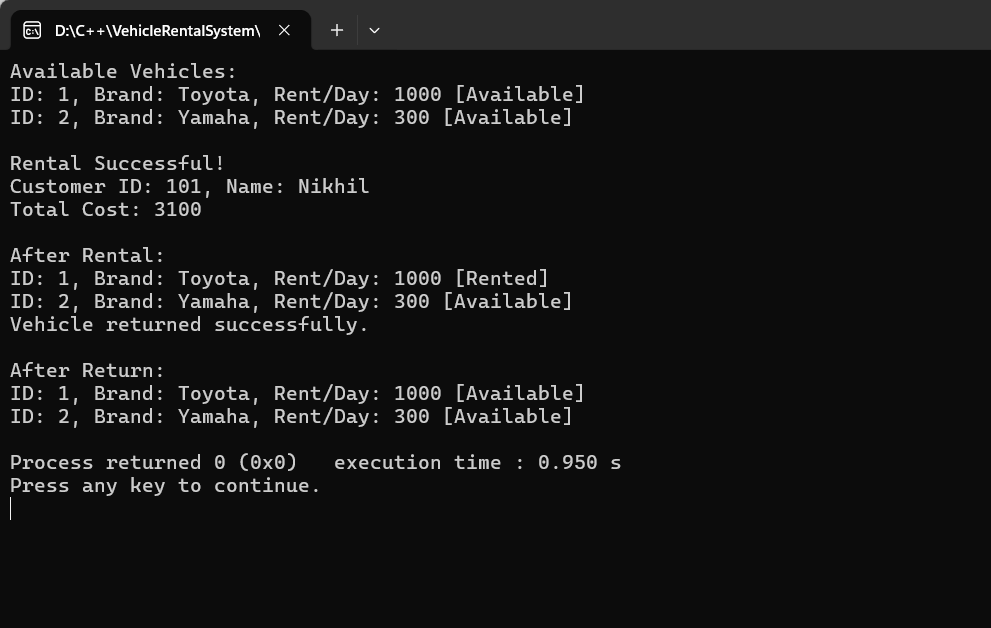

<h1 align="center">
Vehicle Rental System
</h1>

Vehicle Rental System in C++ (OOP Based)

  
<b>Vehicle Rental System</b> is based on the concept of managing vehicle rentals including cars and bikes. This system allows users to view available vehicles, rent them, return them, and calculate rental costs. It demonstrates core Object-Oriented Programming concepts in C++ such as inheritance, polymorphism, abstraction, and encapsulation.

<h2 align="center">
Features of this C++ language based project :
</h2>

- Add Vehicles (Car & Bike)
- View Available Vehicles
- Rent a Vehicle
- Return a Vehicle
- Calculate Rental Cost
- Track Vehicle Availability

<h2>Screenshots :</h2>

<h2>
INFO
</h2>

<footer>

VEHICLE RENTAL SYSTEM IN C++

 
DEVELOPED BY NIKHIL BONDE
</footer>

</footer>
